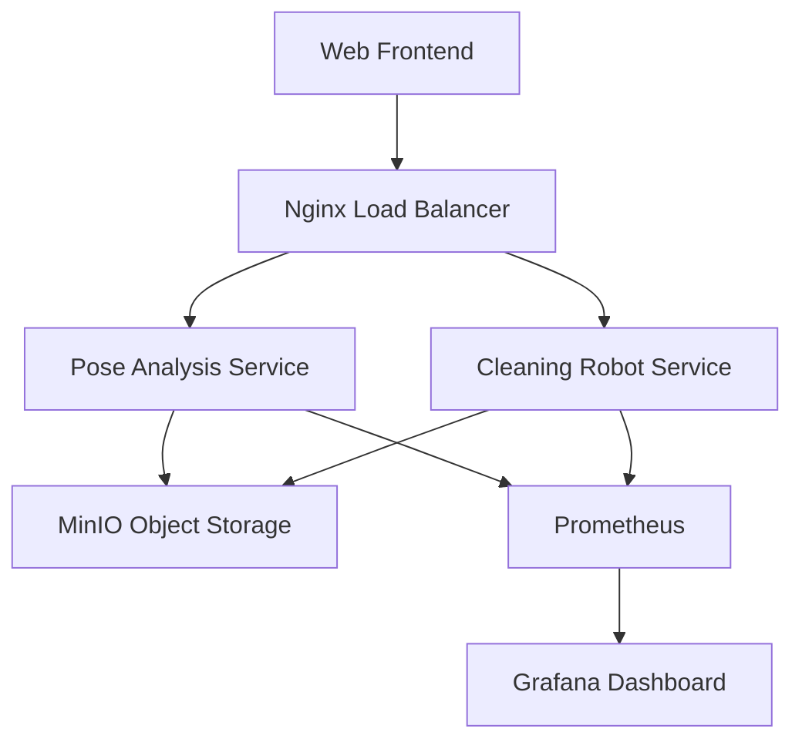

# 基於邊緣運算居家微服務之計算資源管理系統
## Edge Computing Home Microservices Resource Management System (CRMS)


## 📋 專案概述

本專案提出了一套基於邊緣運算的計算資源管理系統，利用微服務架構，專門針對家庭多媒體數據的處理需求。透過在低成本、低功耗的環境中部署多個專業化服務，使用容器化技術讓此系統更有可擴展性和可維護性，並著重於資源受限環境中的數據處理和負載平衡。

### 🎯 核心功能

- **姿勢分析服務**：使用 MediaPipe 進行即時人體姿勢檢測與分析
- **掃地機器人模擬**：智能路徑規劃與清潔狀態監控
- **多媒體數據處理**：影片上傳、處理與結果儲存
- **分散式儲存**：使用 MinIO 進行物件儲存管理
- **實時監控**：Prometheus + Grafana 系統效能監控

## 🏗️ 系統架構



## 🔧 技術棧

### 後端服務
- **Python 3.9+**: 核心服務開發
- **Flask**: Web API 框架
- **MediaPipe**: 電腦視覺與姿勢檢測
- **OpenCV**: 影像處理

### 前端介面
- **Next.js 14**: React 全端框架
- **TypeScript**: 型別安全開發
- **TailwindCSS**: 響應式 UI 設計

### 基礎設施
- **Docker & Docker Compose**: 容器化部署
- **MinIO**: 分散式物件儲存
- **Nginx**: 反向代理與負載平衡
- **Prometheus**: 系統監控
- **Grafana**: 視覺化儀表板

## 🚀 快速開始

### 系統需求
- Docker Engine 20.10+
- Docker Compose v2.0+
- 可用記憶體 4GB+
- 可用磁碟空間 10GB+

### 安裝部署

1. **克隆專案**
```bash
git clone <repository-url>
cd crms
```

2. **啟動所有服務**
```bash
docker-compose up -d
```

3. **驗證服務狀態**
```bash
docker-compose ps
```

### 服務端點

| 服務 | 端口 | 說明 |
|------|------|------|
| Web Frontend | 3000 | 主要使用者介面 |
| Pose Analysis | 5000 | 姿勢分析 API |
| Cleaning Robot | 5001 | 掃地機器人控制 API |
| MinIO Storage | 9000 | 物件儲存服務 |
| MinIO Console | 9001 | MinIO 管理介面 |
| Grafana | 3001 | 監控儀表板 |
| Prometheus | 9090 | 監控數據收集 |
| Nginx | 80 | 反向代理 |

## 📁 專案結構

```
crms/
├── cleaning-robot-service/     # 掃地機器人服務
│   ├── app.py                 # Flask 主應用
│   ├── robot_control.py       # 機器人控制邏輯
│   ├── Moving.py              # 移動控制
│   ├── Navigation.py          # 路徑規劃
│   ├── Sensor.py              # 感測器模擬
│   └── Environment.py         # 環境建模
├── pose-analysis-service/      # 姿勢分析服務
│   ├── app.py                 # Flask 主應用
│   ├── utils/                 # 工具模組
│   │   ├── minio.py          # MinIO 客戶端
│   │   ├── env.py            # 環境配置
│   │   └── extract_frame.py   # 影格提取
│   ├── uploads/               # 上傳檔案目錄
│   └── results/               # 處理結果目錄
├── web-frontend/               # Web 前端應用
│   ├── src/
│   │   ├── pages/            # Next.js 頁面
│   │   ├── service/          # API 服務
│   │   └── app/              # 應用配置
│   ├── package.json
│   └── next.config.mjs
├── tests/                      # 測試套件
│   ├── unit/                  # 單元測試
│   │   ├── test_config.py     # 配置測試
│   │   └── __init__.py        # 套件初始化
│   ├── integration/           # 整合測試
│   │   ├── test_video_upload.py # 影片上傳測試
│   │   └── __init__.py        # 套件初始化
│   ├── e2e/                   # 端到端測試
│   │   ├── system_test_simple.py # 系統基本測試（推薦）
│   │   ├── e2e_test.py        # E2E 完整測試
│   │   ├── simple_e2e_test.py # 簡化版測試
│   │   ├── final_system_test.py # 最終系統測試
│   │   └── __init__.py        # 套件初始化
│   ├── test_runner.py         # 統一測試執行器
│   ├── requirements.txt       # 測試依賴
│   ├── pytest.ini            # pytest 配置
│   ├── __init__.py           # 測試套件初始化
│   └── README.md             # 詳細測試文檔
├── docker-compose.yml          # 服務編排配置
├── nginx.conf                  # Nginx 配置
├── prometheus.yml              # Prometheus 配置
└── README.md
```

## 🔄 使用流程

### 1. 姿勢分析工作流程
1. 透過 Web 介面上傳 MP4 影片檔案
2. 系統自動使用 MediaPipe 進行姿勢檢測
3. 生成分析結果影片並儲存至 MinIO
4. 在介面中查看原始影片與分析結果

### 2. 掃地機器人控制
1. 存取機器人控制介面
2. 開啟/關閉清潔模式
3. 監控機器人狀態與電池電量
4. 查看即時清潔地圖與路徑規劃

## 📊 系統監控

### Grafana 儀表板功能
- **系統資源監控**: CPU、記憶體、磁碟使用率
- **服務健康狀態**: 各微服務運行狀態
- **API 請求統計**: 請求量、回應時間、錯誤率
- **儲存空間監控**: MinIO 儲存使用情況

### 訪問監控介面
```bash
# Grafana 儀表板
http://localhost:3001

# Prometheus 監控數據
http://localhost:9090

# MinIO 管理介面
http://localhost:9001
```

## 🧪 測試與驗證

本專案包含完整的測試套件，涵蓋單元測試、整合測試和端到端測試。詳細的測試說明請參見 [測試套件文檔](tests/README.md)。

### 測試套件安裝
```bash
# 安裝測試依賴
pip install -r tests/requirements.txt
```

### 執行測試

#### 使用測試執行器（推薦）
```bash
# 執行所有測試
python -m tests.test_runner

# 執行特定類型測試
python -m tests.test_runner --type unit      # 單元測試
python -m tests.test_runner --type integration # 整合測試
python -m tests.test_runner --type e2e       # 端到端測試

# 詳細輸出
python -m tests.test_runner --verbose
```

#### 使用 pytest（進階）
```bash
# 執行所有測試
pytest tests/

# 執行特定測試類型
pytest tests/unit/           # 單元測試
pytest tests/integration/    # 整合測試
pytest tests/e2e/           # 端到端測試

# 產生測試覆蓋率報告
pytest tests/ --cov=. --cov-report=html
```

#### 個別測試檔案
```bash
# 系統整體測試（推薦）
python tests/e2e/system_test_simple.py

# 影片上傳整合測試
python tests/integration/test_video_upload.py

# 配置單元測試
python tests/unit/test_config.py

# 完整 E2E 測試
python tests/e2e/e2e_test.py

# 簡化版測試
python tests/e2e/simple_e2e_test.py

# 最終系統測試
python tests/e2e/final_system_test.py
```

### 測試類型說明

#### 🔬 單元測試 (Unit Tests)
測試個別功能組件的獨立運作
- **配置測試**: 驗證系統配置檔案的正確性
- **邏輯測試**: 測試核心業務邏輯
- **工具函數測試**: 測試輔助工具函數

#### 🔗 整合測試 (Integration Tests)
測試服務間的協作與 API 整合
- **影片上傳測試**: 測試影片處理工作流程
- **API 整合測試**: 測試服務間的 API 呼叫
- **資料庫整合測試**: 測試與 MinIO 的整合

#### 🌐 端到端測試 (E2E Tests)
測試完整的使用者工作流程
- **系統整體測試**: 驗證所有服務的協作
- **使用者情境測試**: 模擬真實使用情境
- **效能測試**: 測試系統在負載下的表現

### 測試覆蓋範圍
- ✅ **MinIO 物件儲存服務**: 檔案上傳、下載、儲存桶管理
- ✅ **Web Frontend 使用者介面**: 頁面載入、互動功能、API 呼叫
- ✅ **掃地機器人控制 API**: 控制命令、狀態查詢、路徑規劃
- ✅ **姿勢分析服務**: 影片處理、MediaPipe 整合、結果生成
- ✅ **影片上傳與處理流程**: 完整工作流程驗證
- ✅ **系統配置**: Docker Compose、服務配置、目錄結構
- ✅ **服務健康檢查**: 所有微服務的可用性與回應性
- ✅ **API 整合**: 服務間通訊與資料交換
- ✅ **檔案系統操作**: 影片檔案處理與結果儲存

### 測試報告
執行測試後會產生詳細的測試報告，包括：
- **測試通過率**: 各類型測試的成功率統計
- **錯誤詳情**: 失敗測試的具體錯誤訊息與堆疊追蹤
- **覆蓋率報告**: 程式碼測試覆蓋率分析（使用 `--cov` 參數）
- **效能指標**: 測試執行時間與系統回應效能
- **服務狀態**: 各微服務的健康檢查結果

### 測試配置
測試套件使用以下預設配置：
```python
TEST_CONFIG = {
    "MINIO_URL": "http://localhost:9000",
    "CLEANING_SERVICE_URL": "http://localhost:5001", 
    "POSE_SERVICE_URL": "http://localhost:5000",
    "WEB_FRONTEND_URL": "http://localhost:3000",
    "TEST_VIDEO_PATH": "video/test1.mp4",
    "TEST_TIMEOUT": 30
}
```

## 🔧 開發與部署

### 開發環境設置
```bash
# 建立開發環境
docker-compose -f docker-compose.dev.yml up -d

# 查看服務日誌
docker-compose logs -f [service-name]

# 重新建立特定服務
docker-compose build [service-name]
docker-compose restart [service-name]
```

### 生產部署考量
- **資源限制**: 根據硬體規格調整容器資源限制
- **資料持久化**: 配置適當的 Volume 掛載
- **安全性配置**: 修改預設密碼與存取控制
- **網路配置**: 適當配置防火牆與端口訪問

## 🛠️ 故障排除

### 常見問題

**Q: 影片上傳失敗，顯示 "Failed to fetch" 錯誤**
```bash
# 檢查 API 服務狀態
curl http://localhost:5000
docker logs crms-pose-analysis-service-1
```

**Q: 掃地機器人服務無回應**
```bash
# 重新啟動機器人服務
docker-compose restart cleaning-robot-service
```

**Q: MinIO 連接失敗**
```bash
# 檢查 MinIO 服務狀態
docker logs crms-minio-1
curl http://localhost:9000/minio/health/live
```

### 日誌查看
```bash
# 查看所有服務日誌
docker-compose logs

# 查看特定服務日誌
docker-compose logs -f pose-analysis-service
docker-compose logs -f cleaning-robot-service
docker-compose logs -f web-frontend
```

## 📈 效能優化

### 系統調優建議
- **容器資源分配**: 根據使用情況調整 CPU 與記憶體限制
- **影片處理優化**: 使用適當的編解碼器與壓縮參數
- **快取策略**: 實作適當的快取機制減少重複計算
- **負載平衡**: 使用多個實例處理高併發請求

## 🤝 貢獻指南

1. Fork 專案
2. 建立功能分支 (`git checkout -b feature/AmazingFeature`)
3. 提交變更 (`git commit -m 'Add some AmazingFeature'`)
4. 推送到分支 (`git push origin feature/AmazingFeature`)
5. 開啟 Pull Request

## 📄 授權

本專案採用 MIT 授權 - 詳見 [LICENSE](LICENSE) 檔案

## 🆘 支援與聯絡

- **問題回報**: 請使用 GitHub Issues
- **功能請求**: 請透過 GitHub Discussions
- **技術文件**: 參見 `/doc` 目錄

---

*本專案為邊緣運算技術在智慧家庭應用的研究實作，展示了微服務架構在資源受限環境下的可行性與優勢。*